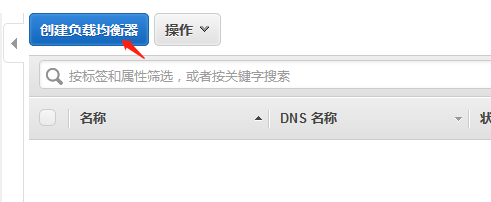
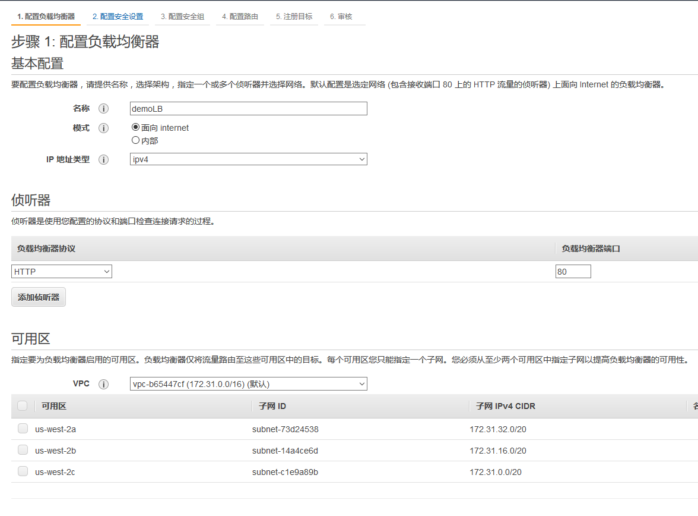
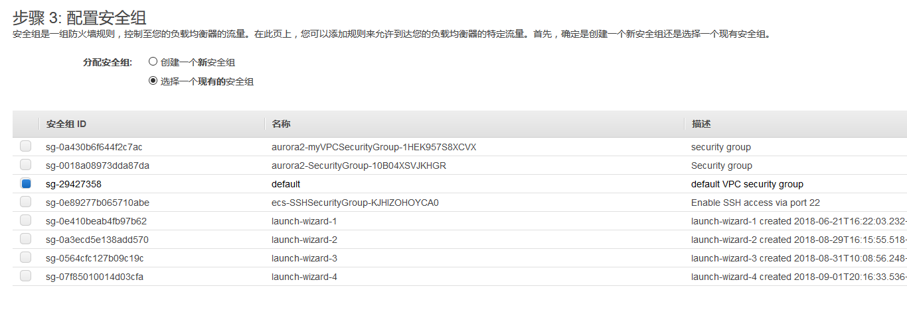
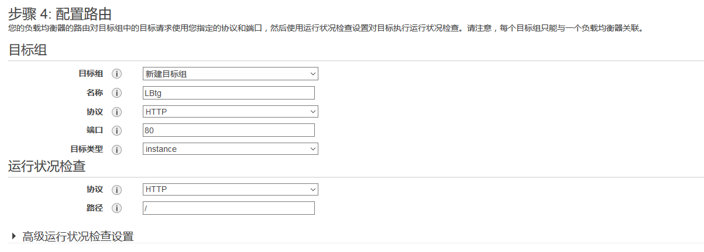
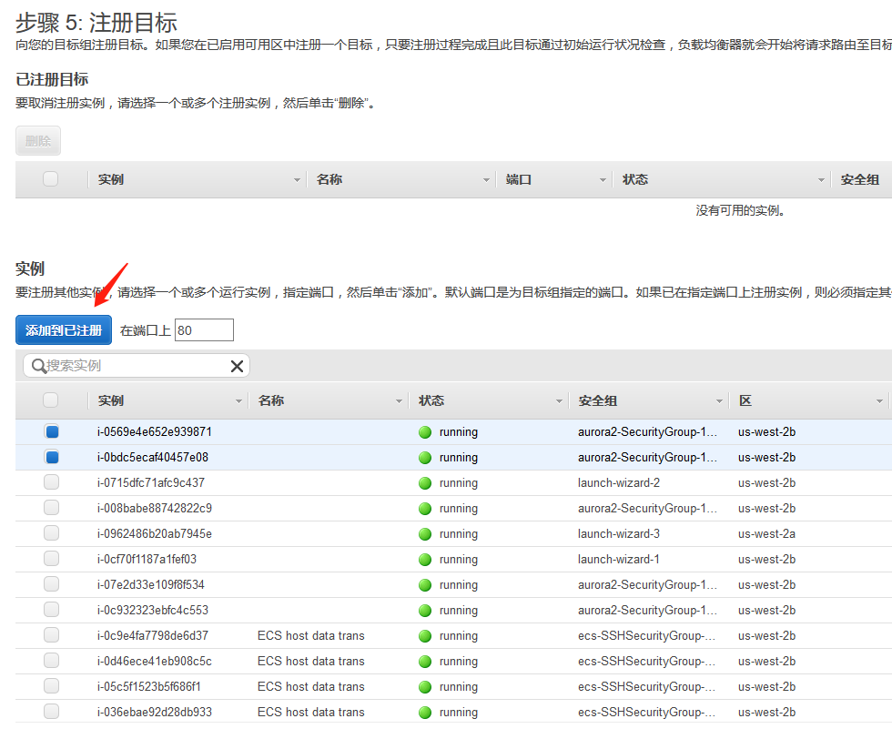
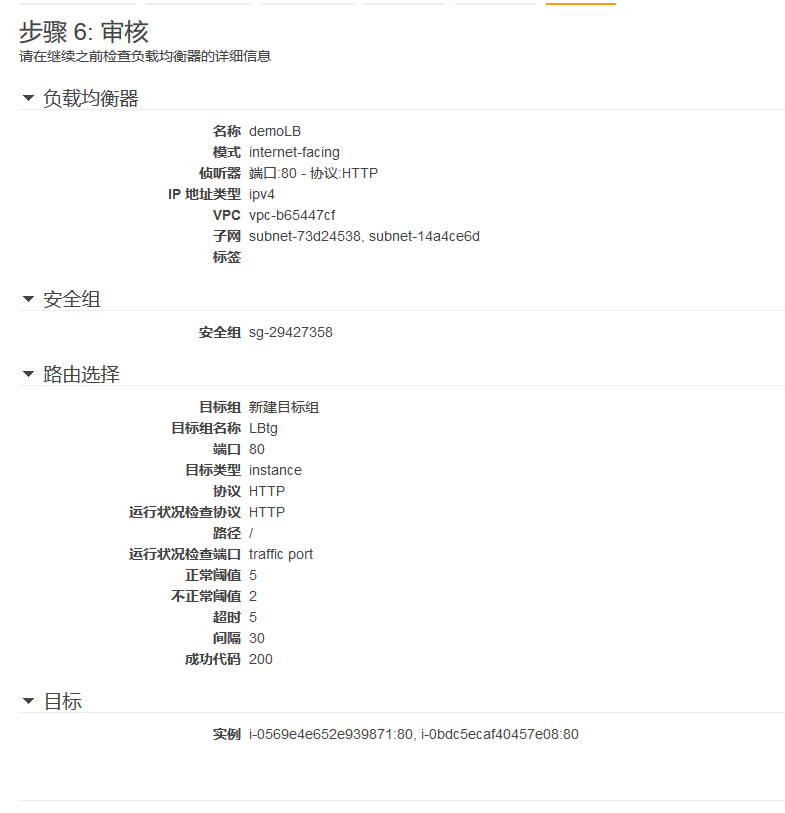

### 准备工作
- 选择两个可用区，可用区中有至少一个带有共有子网的VPC
- 在每个vpc中启动ec2实例
- 在每个ec2中安装web服务器，确保这些实例的安全组允许端口 80 上的 HTTP 访问。 
### 步骤 1：选择负载均衡器类型
1. 打开 [Amazon EC2 控制台](https://console.aws.amazon.com/ec2/)。
1. 在导航栏上，选择您的负载均衡器的区域。请确保选择用于 EC2 实例的同一个区域。
   
1. 在导航窗格上的 LOAD BALANCING 下，选择 Load Balancers。
   
1. 选择 Create Load Balancer。
   
1. 对于 Application Load Balancer，选择 Create。
   
### 步骤 2：配置负载均衡器和侦听器

在 Configure Load Balancer 页面上，完成以下过程。

1. 配置负载均衡器和侦听器
1. 对于 Name，键入负载均衡器的名称。
1. 在区域的 Application Load Balancer 和 Network Load Balancer 集内，应用程序负载均衡器 的名称必须唯一，最多可以有 32 个字符，只能包含字母数字字符和连字符，不能以连字符开头或结尾，并且不能以“internal-”开头。
1. 对于 Scheme 和 IP address type，请保留默认值。
1. 对于 Listeners，保留默认值，默认侦听器负责接收端口 80 上的 HTTP 流量。
1. 对于 Availability Zones，选择用于 EC2 实例的 VPC。对于用于启动 EC2 实例的每个可用区，选择一个可用区，然后为该可用区选择公有子网。
1. 选择 Next: Configure Security Settings。
1. 在本教程中，将不创建 HTTPS 侦听器。选择 Next: Configure Security Groups。
   
### 步骤 3：为负载均衡器配置安全组

您负载均衡器的安全组必须允许其通过侦听器端口和运行状况检查端口与已注册目标进行通信。控制台可以代表您创建负载均衡器的安全组，其中包括指定正确协议和端口的规则。如果您愿意，也可以自行创建和选择安全组。

1. 选择 Create a new security group。
1. 为安全组键入名称和描述，或者保留默认名称和描述。此新安全组包含一条规则，该规则允许将流量传送到在 Configure Load Balancer 页面上选择的负载均衡器侦听器端口。
1. 选择 Next: Configure Routing。
   
   
   
### 步骤 4：配置目标组

创建一个要在请求路由中使用的目标组。您侦听器的默认规则将请求路由到此目标组中的已注册目标。负载均衡器使用为目标组定义的运行状况检查设置来检查此目标组中目标的运行状况。在 Configure Routing 页面上，完成以下过程。

配置目标组

1. 对于 Target group，保留默认值 New target group。
1. 对于 Name，键入新目标组的名称。
1. 将 Protocol 保留为“HTTP”，Port 为“80”，Target type 为“instance”。
1. 对于 Health checks，保留默认协议和 ping 路径。
1. 选择 Next: Register Targets。
      
### 步骤 5：向您的目标组注册目标

在 Register Targets 页面上，完成以下过程。

向目标组注册目标

1. 对于 Instances，选择一个或多个实例。
1. 保留默认端口 80，并选择 Add to registered。
1. 当您完成选择实例后，选择 Next: Review。
      
	  
	  
### 步骤 6：创建并测试您的负载均衡器

在创建负载均衡器之前，请检查所选的设置。在创建负载均衡器之后，可以验证其是否将流量发送到您的 EC2 实例。

创建并测试您的负载均衡器
1. 在 Review 页面上，选择 Create 。
   
1. 在您收到已成功创建负载均衡器的通知后，选择 Close。
   
1. 在导航窗格上的 LOAD BALANCING 下，选择 Target Groups。
1. 选择新创建的目标组。
   
1. 在 Targets 选项卡中，验证您的实例是否已准备就绪。如果实例状态是 initial，很可能是因为，实例仍在注册过程中，或者未通过视为正常运行所需的运行状况检查最小数量。在您的至少一个实例的状态为 healthy 后，便可测试负载均衡器。
1. 在导航窗格上的 LOAD BALANCING 下，选择 Load Balancers。
1. 选择新创建的负载均衡器。
   
1. 在 Description 选项卡中，复制负载均衡器 (例如，my-load-balancer-1234567890.us-west-2.elb.amazonaws.com) 的 DNS 名称。将 DNS 名称粘贴到已连接 Internet 的 Web 浏览器的地址栏中。如果一切正常，浏览器会显示您服务器的默认页面。
   
### 基于路径的路由:
1. 创建第二个目标组
1. 选择新创建的负载均衡器。
1. 在 Listeners选项卡中，使用箭头查看侦听器的规则，然后选择 Add rule。按如下所示指定规则：
1. 对于 Target group name，选择您创建的第二个目标组。
1. 对于 Path pattern，指定针对基于路径的路由使用的准确模式 (例如，/img/*)。
1. 选择 Save。
### 使用微服务作为应用程序负载均衡器的目标
您可以在各 EC2 实例上安装一个或多个这样的服务，每个服务在不同端口上接受连接。您可以使用单个应用程序负载均衡器将请求路由到应用程序的所有服务。在您将 EC2 实例注册到目标组时，可以多次注册；对于每个服务，使用该服务的端口注册实例。 
### 步骤 6：删除您的负载均衡器 (可选)

在您的负载均衡器可用之后，您需要为保持其运行的每小时或部分小时支付费用。当您不再需要负载均衡器时，可将其删除。

删除您的负载均衡器

1. 在导航窗格中的 LOAD BALANCING 下，选择 Load Balancers。
1. 选择负载均衡器，然后选择 Actions 和 Delete。
1. 当系统提示进行确认时，选择 Yes, Delete。
### 相关概念及配置：ttt
[个负载均衡器](https://docs.aws.amazon.com/zh_cn/elasticloadbalancing/latest/application/application-load-balancers.html)

[侦听器](https://docs.aws.amazon.com/zh_cn/elasticloadbalancing/latest/application/load-balancer-listeners.html)

[目标组](https://docs.aws.amazon.com/zh_cn/elasticloadbalancing/latest/application/load-balancer-target-groups.html)

[监控](https://docs.aws.amazon.com/zh_cn/elasticloadbalancing/latest/application/load-balancer-monitoring.html)
