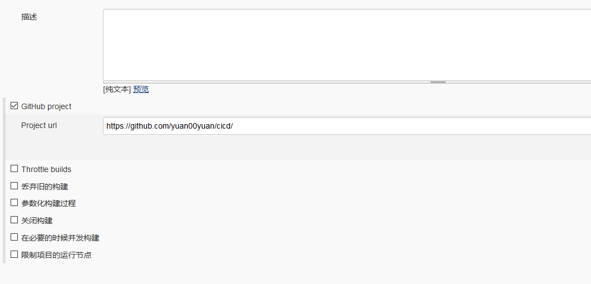
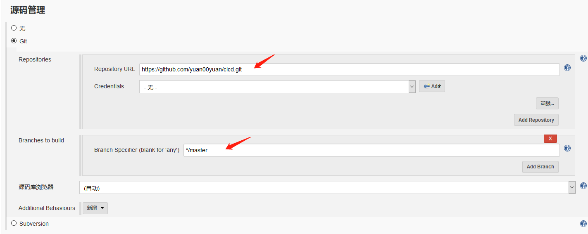
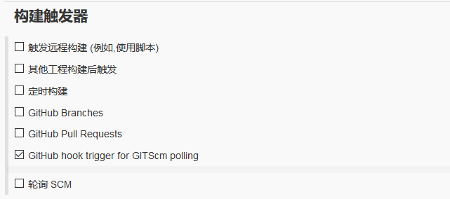
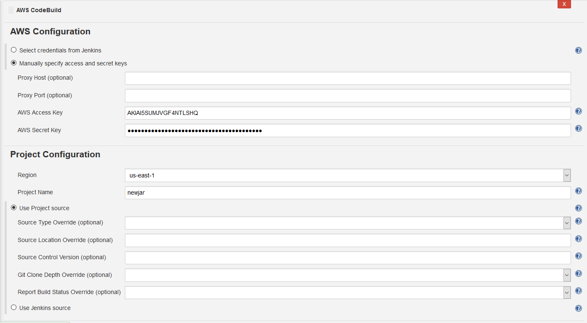
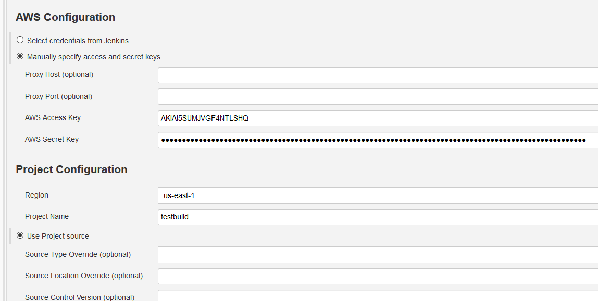
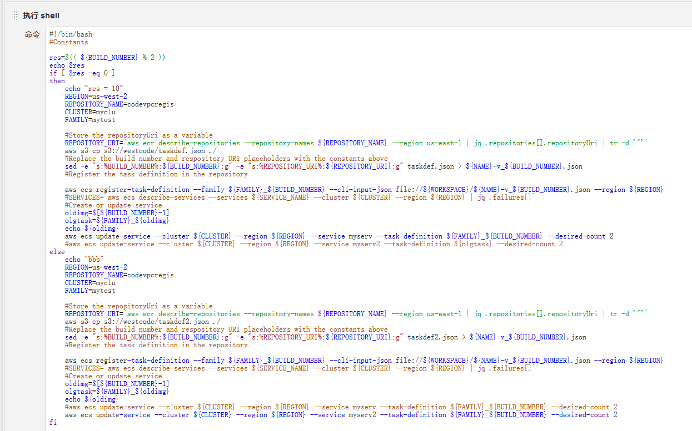
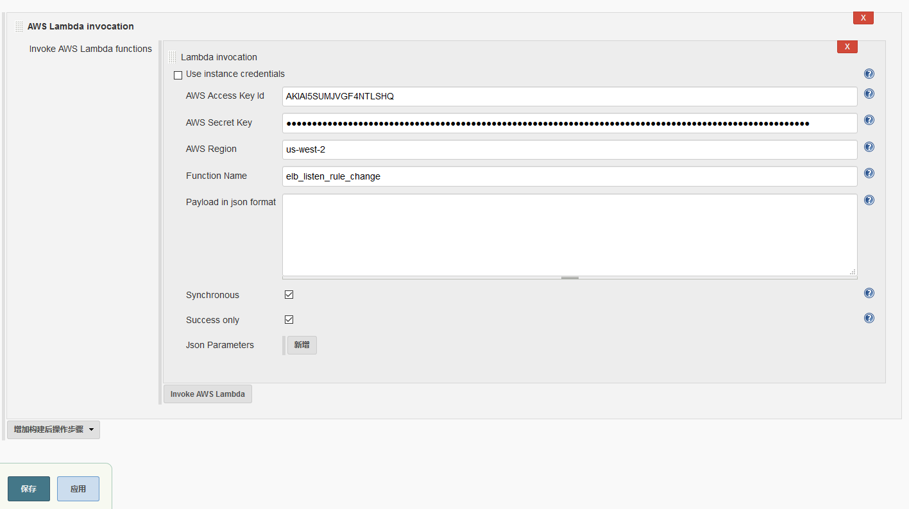

##### 概述：
本文讲述的是用jenkins做容器蓝绿部署所需相关配置， 其中涉及到的codeBuild相关的配置同文章： cicd docker bule codePipe（https://github.com/yuan00yuan/quickstart-guide/blob/master/cicd%20docker%20blue%20codepipe.md）
##### 步骤：
1. 创建jenkins项目
2. 定义源码地址和代码更新触发
3. 增加构建步骤： 源码->jar包
4. 增加构建步骤： jar包-> docker镜像
5. 增加构建后操作： 切换生产端口
##### 1. 创建自由风格的项目
##### 2. 输入github项目的地址
  
##### 3. 输入github项目的git地址和分支
  
##### 4. 勾选Github hook trigger for GITScm polling  实现github代码更新的自动触发
  
##### 5. 点击“添加构建步骤”  选择“AWS cloud build”插件
##### 6. 输入aws的accessId 和accessKey
##### 7. 输入code build项目的项目名称和可用区
  
##### 8. 点击“添加构建步骤”  选择“AWS cloud build”插件
##### 9. 输入aws的accessId 和accessKey
##### 10. 输入code build项目的项目名称和可用区
##### 11. 此项目目的为把源码打包为jar包并上传到S3桶中
  
##### 12. 选择“添加构建步骤“
##### 13. 选择“执行 shell“
  
  
  本段代码的逻辑是：
1.	根据build_number也就是每次build的环境变量值，我们判断使用哪个任务定义模板  区别在于不同的模板中容器与实例的端口号对应不同
2.	根据新的参数创建新的任务定义，
3.	更新服务中运行的任务为新任务

##### 14. 点击“添加构建后操作”
##### 15.选择 lambda invocation
1. 填写acces Id和access Key
2. 填写lambda所在的可用区和即将调用的lambda名称
  

Lambda逻辑为：

1. Elb接了三个监听器  80 8080 1234 分别对应两个目标组 tg1 tg2
2. 目标组有一个tag: isProduction:Boolean  代表此目标组目前是不是生产环境所用目标组
3. 我们将更新过的非生产环境的目标组 作为80端口的监听目标组  进行服务更新
并且更新目标组的tag

Lambda代码为：
 	https://s3-us-west-2.amazonaws.com/westcode/blue_lambda.py
  
##### 16. 点击“应用“”保存“
##### 17. 点击“立即构建“
