- ### 创建jenkins
1. 创建Amazon EC2实例，选择实例类型和添加存储。
   
2. 在“高级详细信息”里面输入启动脚本
   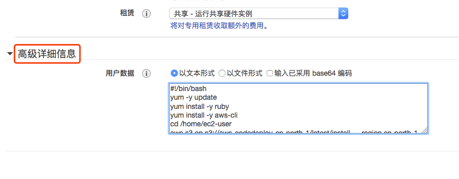

```
#!/bin/bash
yum -y update
yum install -y ruby
yum install -y aws-cli
yum install –y git
cd /home/ec2-user
wget https://bucket-name.s3.amazonaws.com/latest/install
chmod +x ./install
./install auto

```
3. bucket name对应列表为
    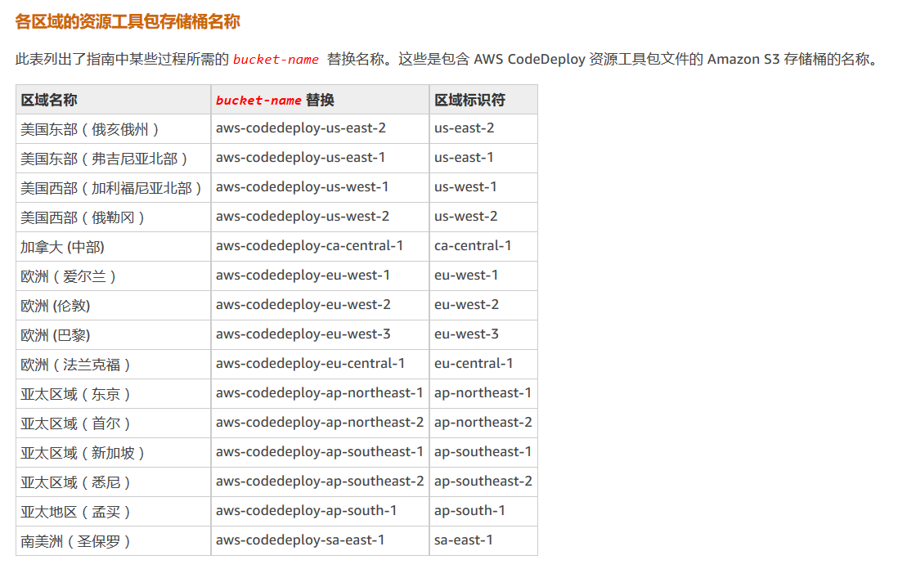
4.  EC2启动成功后，使用SSH到该EC2，使用如下命令检验Agent是否工作正常。

```
sudo service codedeploy-agent status
Result: The AWS CodeDeploy agent is running as PID 3523

```
- ### 使用Github托管源代码，并配置webhook自动触发
1. 首先进入自己的Github地址，点击https://github.com/settings/tokens，生成GitHub token，这个token用于jenkins访问GitHub。

    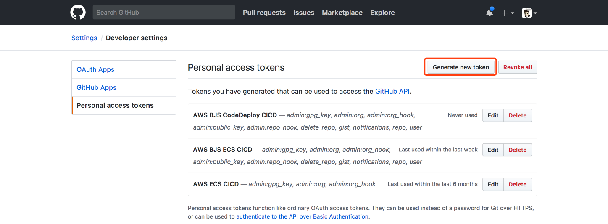
2. 为需要做CI/CD的GitHub创建hook，实现代码更新自动通知Jenkins，Payload URL设置Jenkins Server的地址，默认Jenkins监听8080端口。记录下生成的token字符串，比如： bf6adc27311a39ad0b5c9a63xxxxxxxxxxxxxx
3. 创建一个新的repository
   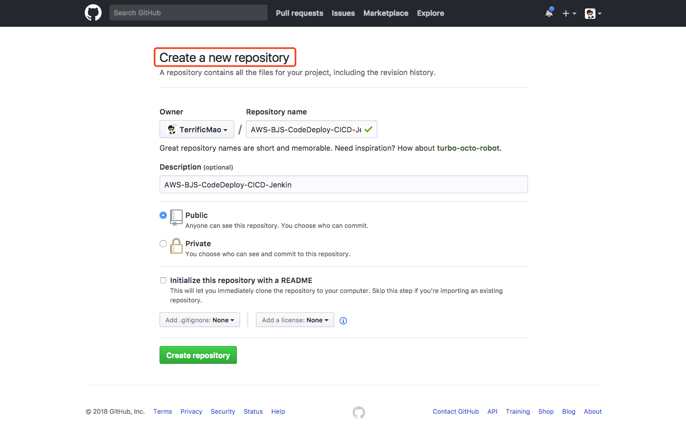
4. 创建本次环境所需要的Git仓库，比如名为AWS-BJS-CodeDeploy-CICD-Jenkins。点击“Settings”配置webhooks。
   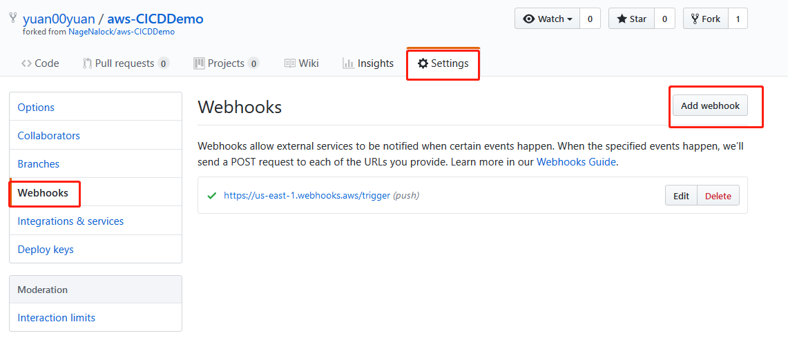
5. 点击“Add Webhooks”
6. 在Payload URL，输入http://EC2公网IP地址/github-wekhook/，如下图所示：
    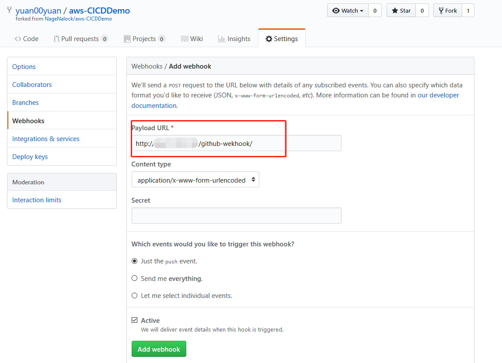
- ### 部署Jenkins，并安装CodeDeploy插件
1. 安装如何脚本安装Jenkins，默认Java的环境是1.7的，可以先升级到Java 1.8版本。

```
sudo -s
java –version
yum install java-1.8.0
yum remove java-1.7.0-openjdk
wget -O /etc/yum.repos.d/jenkins.repo http://jenkins-ci.org/redhat/jenkins.repo
rpm --import http://pkg.jenkins-ci.org/redhat/jenkins-ci.org.key
yum install jenkins
chkconfig jenkins on
service jenkins start
//查看Jenkins默认密码
cat /var/lib/jenkins/secrets/initialAdminPassword

```
2. 在浏览器输入输入EC2的公网IP地址（最好绑定一个弹性EIP），比如54.223.215.xx:8080，然后出现如下界面，输入上面得到的默认密码。
     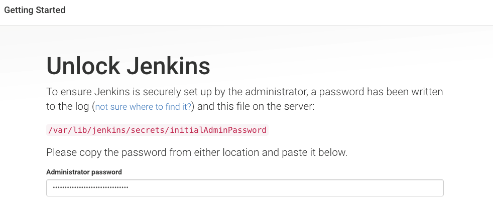
     
3. 创建用户名和密码，就到如下界面，这个时候Jenkins就可以进行配置了。
     
4. 进入系统配置
     
5. 输入Jenkins URL，点击“Add”添加Jenkins
     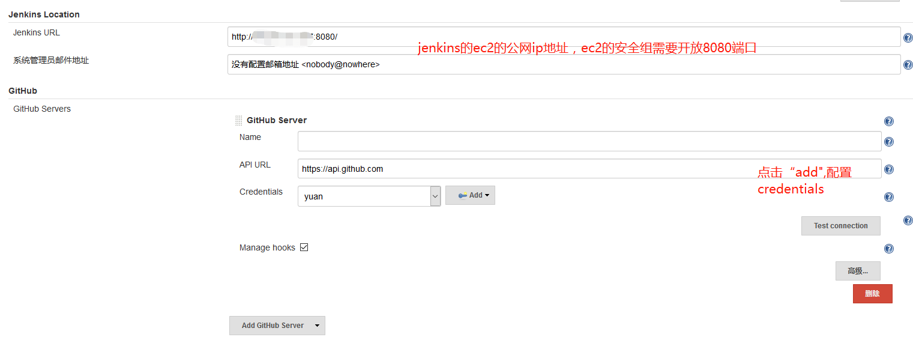
6. 输入Github获取的Access Token，点击“添加”。
     
7. 点击“Test Connection”，没有报错说明配置成功。
     
8. 添加管理插件
     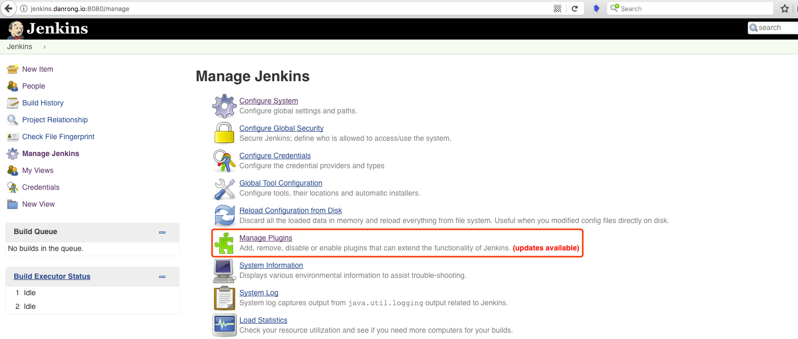
9. 添加AWS CodeDeploy的插件，点击“Install without restart”
     
10. 新建一Jenkins个项目，点击“Create a new project”
     
11. 配置Github项目的地址，源代码管理选择Git方式。
     
12. 触发构建，选择Github hook trigger for GITScm polling

     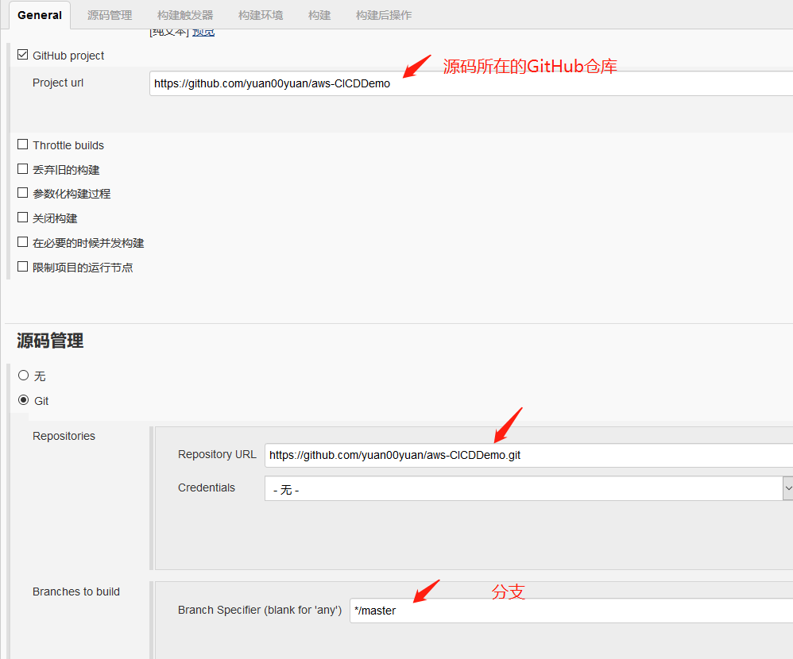
     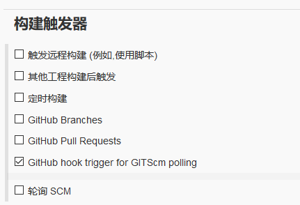
13. 选择“添加构建步骤”

    选择“AWS cloud build”插件
    
    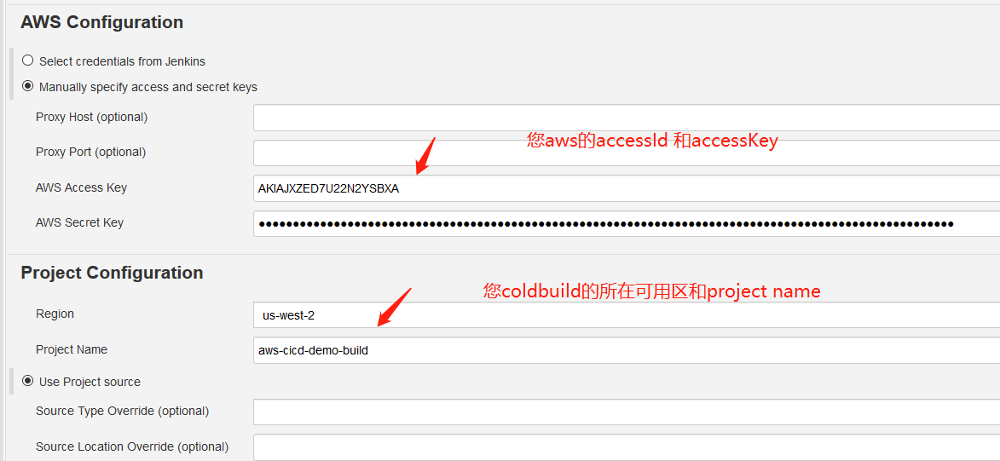
14. 其余保持空白

    点击“添加构建步骤”
    
    选择执行 shell
    
    
```
aws s3 cp s3://yuan0928/target/test_springboot.jar ./   //您在codeBuild中写的文件输出的位置
mkdir target
mv test_springboot.jar target/

```

   这三行脚本的意思是把上一步骤生成的jar包添加到环境中，方便后续的部署工作。
   
   
    
15. 选择“Post-build Actions”，输入CodeDeploy相关信息，区域选择您所在的code deploy的region
认证方式可以输入AWS Access Key和Security Key，如果是生产环境建议使用临时的credentials。
     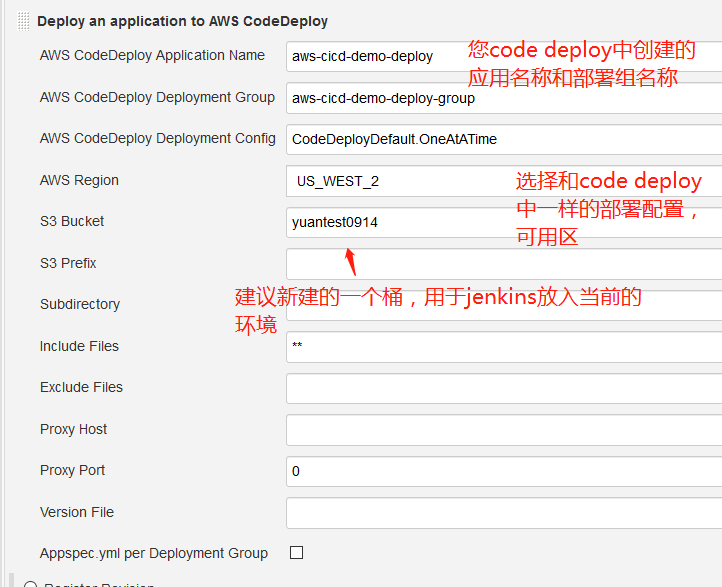
     
16. 点击“应用” “保存”
